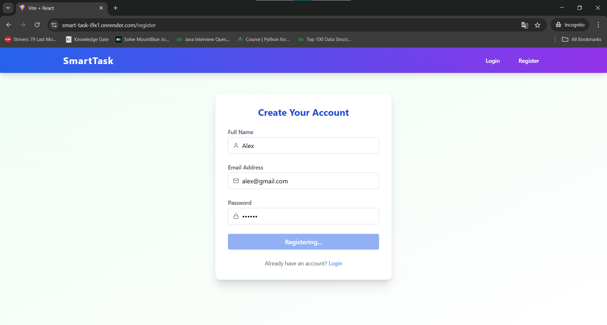
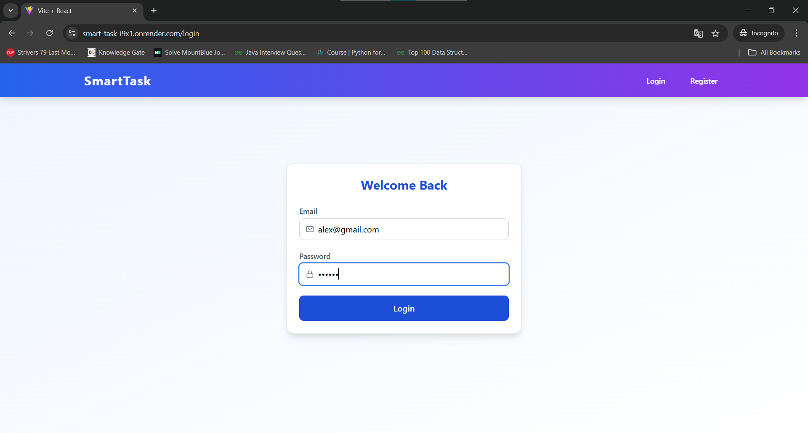
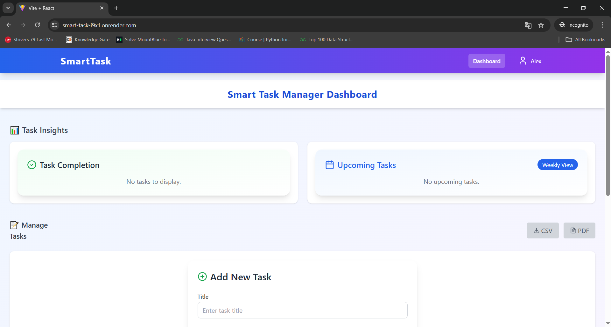
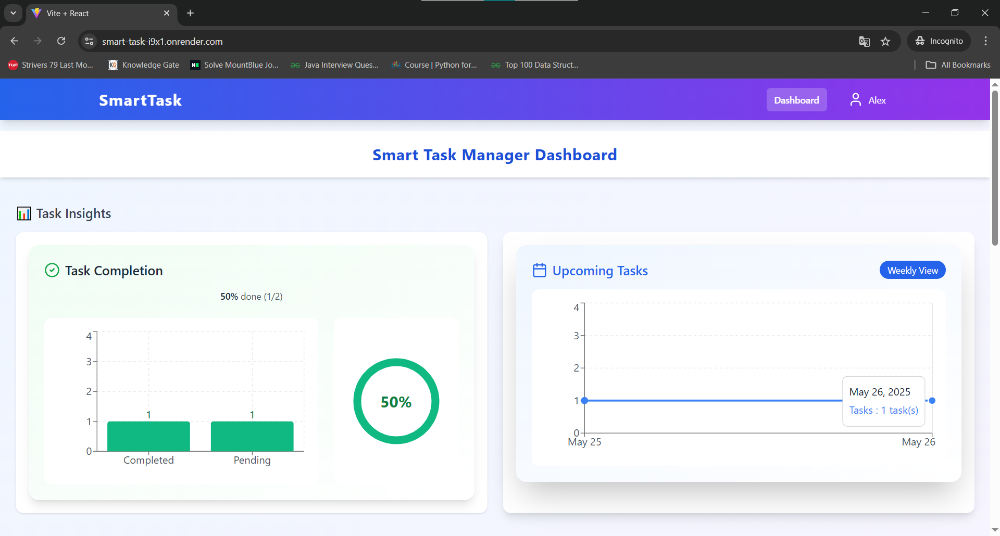
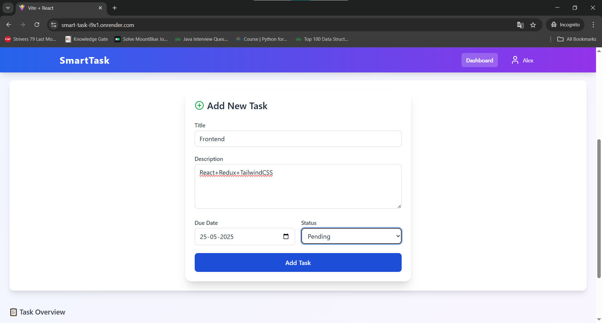
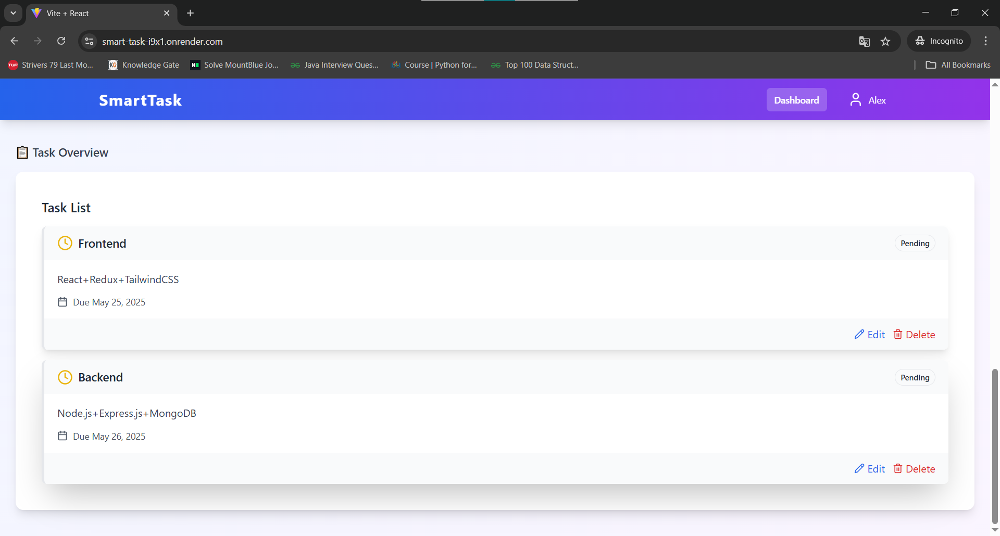
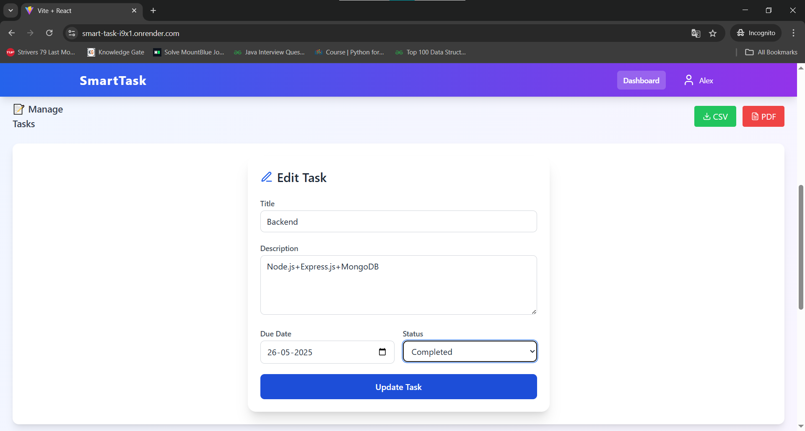
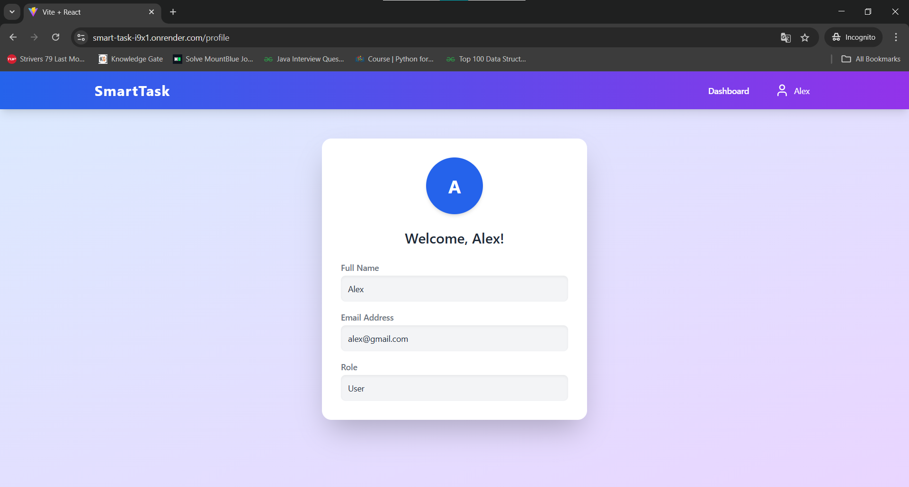
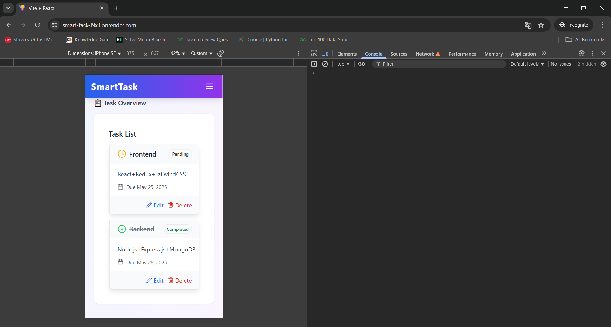

# 🧠 Smart Task Manager

Smart Task Manager is a full-stack task management application designed to help users efficiently create, manage, and track tasks with advanced features like authentication, analytics, and role-based access.

## 🚀 Tech Stack

### Frontend
- React.js (via Vite)
- Tailwind CSS
- Redux Toolkit
- Axios

### Backend
- Node.js
- Express.js
- MongoDB (Mongoose)
- JWT Authentication
- dotenv for environment configs

---

## ✨ Features

- 🔐 JWT-based Authentication (Login, Register, Logout)
- 👤 Admin & User Roles
- 📋 Task CRUD Operations
- 📊 Analytics Dashboard (Task stats)
- ⏱️ Due Dates, Status Tracking
- 🕵️ Audit Logs (admin view)
- 📦 Export Options (coming soon)
- 🌐 Responsive UI

---

## 📁 Folder Structure

ecommerce-project/ ├── client/ # Frontend (React + Tailwind) ├── server/ # Backend (Express + MongoDB) └── README.md

---

## 🖼️ Screenshots

###  Register


###  Login


### Home


### Graph


### Crate-Tasks


### Tasks


### Update-Tasks


### Profile


### Mobile-Responsive


---

## 🌐 Live Demo

👉 [Click here to view live demo](https://smart-task-i9x1.onrender.com/)

---


### Clone the repository

```bash
git https://github.com/Khiladi19/SmartTask-Management-.git
cd smart-task-manager
```

###  Backend Setup

```bash
cd server
npm install
npm run dev
```

### Frontend Setup
```bash
cd client
npm install
npm run dev
```
Visit: http://localhost:5173

---

### Environment Variables
Create .env files in both client/ and server/:
VITE_API_URL=http://localhost:2000

server/.env
MONGO_URI=your_mongodb_uri
JWT_SECRET=your_jwt_secret
---

👨‍💻 Developed by
Abhishek Kumar

🔗 [Connect with me on LinkedIn](https://www.linkedin.com/in/abhishek-kumar193/)

📝 License
This project is open-source and free to use.

🙌 Thank You
Thanks for checking out this project! 😊